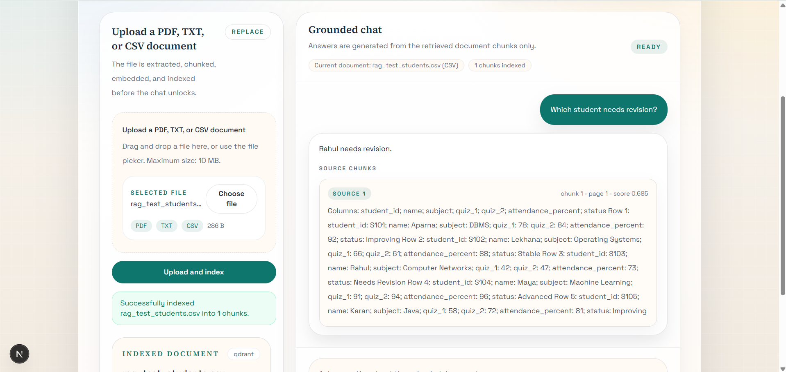
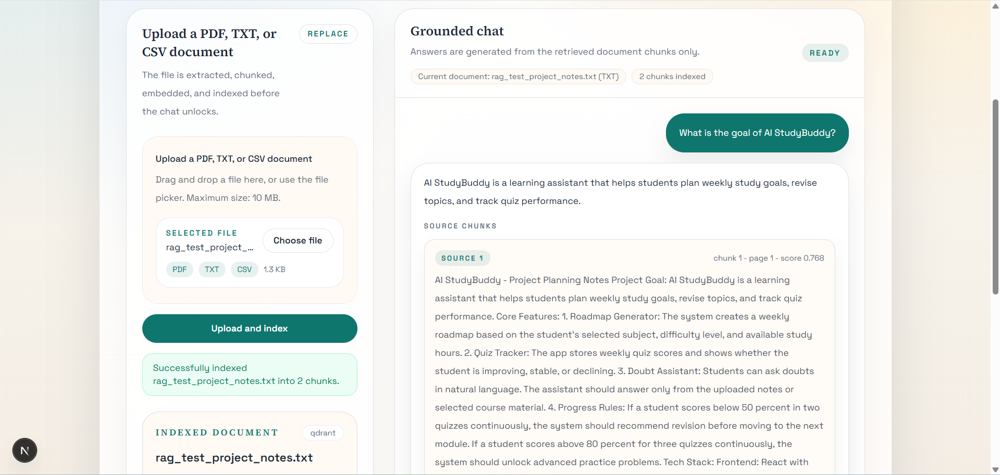
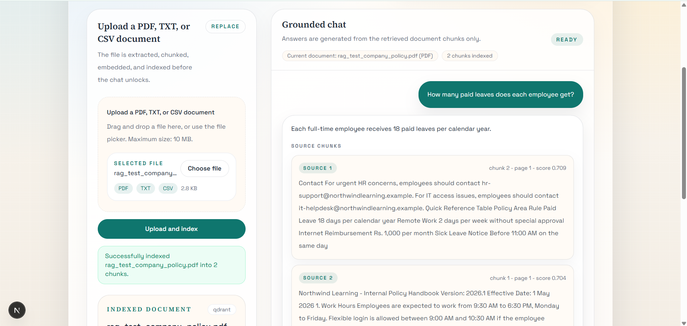
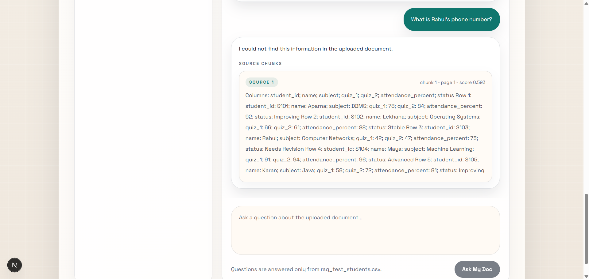

# Ask My Doc RAG

Ask My Doc RAG is a grounded question-answering app built with `Next.js`, `TypeScript`, `Gemini`, and `Qdrant`. It indexes user-provided sources into a workspace and answers questions only from retrieved workspace context.

The current implementation supports:

- `PDF`, `TXT`, and `CSV` file uploads
- optional public web page ingestion
- multi-source workspaces in one session
- workspace-wide retrieval
- Corrective RAG with retrieval grading, one rewrite attempt, a second retrieval pass, and honest refusal when context is insufficient

If the indexed sources do not contain enough information, the app returns:

`I could not find this information in the uploaded document.`

## What It Does

Ask My Doc RAG is designed for source-grounded Q&A:

- users can upload multiple files into one active workspace
- users can add a public URL as another source in that same workspace
- chunks are embedded with Gemini and stored in Qdrant, with an in-memory fallback during local development
- chat retrieves from all sources in the active workspace instead of only one file
- source metadata is preserved so answers can show source type, source name, score, and page or URL details

## Features

- Upload `PDF`, `TXT`, and `CSV` documents
- Add a public `WEB` source by URL
- Group sources into one active workspace during the current session
- Keep uploaded file support and the existing Gemini + Qdrant pipeline
- Retrieve only from indexed chunks in the active workspace
- Use Corrective RAG before answer generation
- Show source-aware answer cards with `PDF`, `TXT`, `CSV`, or `WEB` badges
- Refuse to answer when no indexed source contains enough supporting context

## Demo Screenshots

### CSV Question Answering



### TXT Question Answering



### PDF Question Answering



### Grounded Refusal



## Tech Stack

- `Next.js` App Router
- `TypeScript`
- `Tailwind CSS`
- `Gemini API` via `@google/genai`
- `Qdrant` vector storage
- `pdf-parse` for PDF extraction
- `Papa Parse` for CSV extraction
- `cheerio` for HTML parsing during URL ingestion
- `Docker` for local Qdrant setup

## Multi-Source Workspace

The app now uses a workspace-oriented retrieval model.

- each indexed source gets its own `sourceId`
- the active session keeps a `workspaceId`
- all chunks store workspace and source metadata
- chat retrieval is filtered by `workspaceId`
- chunks from other workspaces are not mixed into the current session

Source metadata stored with each chunk includes:

- `workspaceId`
- `sourceId`
- `documentId` as a backward-compatible alias for the source id
- `sourceName`
- `sourceType`
- `sourceUrl` for web sources
- `fileName` and `fileType` when the source came from an uploaded file
- `chunkIndex`
- `pageNumber` when available
- `snippet`
- `text`

## URL Ingestion

Users can add a public web page through `POST /api/ingest-url`.

Behavior:

- only `http` and `https` URLs are accepted
- localhost, loopback, and obvious private-network targets are rejected
- the page is fetched once during ingestion
- the app does not browse live during chat
- the HTML is parsed server-side with `cheerio`
- script, style, and common navigation noise are removed where possible
- readable text is chunked, embedded, and stored as a `WEB` source

Security and operational safeguards:

- no browser automation
- no JavaScript execution
- fetch timeout
- HTML byte limit
- redirect cap

## Corrective RAG

The existing Corrective RAG flow is preserved and now runs across the active workspace.

For each chat question:

1. the app embeds the question
2. it retrieves top chunks from the active workspace
3. it grades whether the retrieved context is strong enough
4. if the first retrieval passes, it answers normally
5. if the first retrieval is weak, it rewrites the query once
6. it retrieves again from the same workspace
7. if the second retrieval is still weak, it refuses instead of hallucinating

The corrective metadata returned by the chat API includes:

- `enabled`
- `initialQuery`
- `rewrittenQuery` when used
- `initialRetrievalPassed`
- `secondRetrievalUsed`
- `finalRetrievalPassed`
- `reason`
- `retrievalMode`

`retrievalMode` is one of:

- `direct`
- `corrected`
- `insufficient_context`

## Retrieval and Generation Pipeline

The current architecture is:

File or URL source
-> Extract readable text
-> Chunk text
-> Create Gemini embeddings
-> Store vectors in Qdrant with workspace and source metadata
-> Retrieve across the active workspace
-> Grade retrieved context
-> If weak, rewrite query
-> Retrieve again
-> Generate grounded answer or refuse

More concretely:

1. A user uploads a file or adds a public web page.
2. The backend extracts readable text.
3. The source is split into retrieval-friendly chunks.
4. Gemini creates embeddings for those chunks.
5. The vectors are stored with workspace and source metadata.
6. When the user asks a question, the app retrieves across all indexed sources in the active workspace.
7. Corrective RAG decides whether the retrieval is good enough.
8. The answer generator uses only the final retrieved chunks.
9. If the workspace does not contain enough supporting context, the app refuses to answer.

## Supported Sources

### File Uploads

- `PDF`
- `TXT`
- `CSV`

Accepted file extensions and MIME types:

- `.pdf`
- `.txt`
- `.csv`
- `application/pdf`
- `text/plain`
- `text/csv`
- `application/csv`
- `application/vnd.ms-excel`

### Web Sources

- public `http` and `https` pages only

## CSV Handling

CSV files are parsed into readable row text before chunking so that embeddings and retrieval work better on tabular content.

Example shape:

```text
Columns: name; marks; subject
Row 1: name: Aparna; marks: 92; subject: DBMS
Row 2: name: Lekhana; marks: 88; subject: OS
```

## Chunking Strategy

The chunker is still optimized for readable retrieval units.

- target chunk size: `900-1200` characters
- overlap: `180` characters
- paragraph and sentence boundaries are preferred when possible
- empty chunks are skipped

## Vector Storage

Qdrant remains the primary vector store.

Current behavior:

- a collection is created automatically if needed
- chunk payloads include workspace and source metadata
- retrieval is filtered by `workspaceId` for normal workspace chat
- backward-compatible document-level retrieval can still use `documentId`
- an in-memory fallback is available during local development when Qdrant is unavailable

### In-Memory Fallback

The in-memory vector store is intended only for local development.

- it is not persistent
- it is cleared on server restart
- it is not suitable for production or hosted deployments

## Grounded Answering Rules

The answer generator is instructed to:

- answer only from the provided retrieved context
- avoid outside knowledge
- avoid guessing
- return the refusal message when the answer is not supported by the indexed sources

## API Summary

### `POST /api/upload`

Accepts multipart form data with:

- `file`
- optional `workspaceId`
- optional `storage`

Returns JSON including:

- `success`
- `workspaceId`
- `sourceId`
- `documentId`
- `sourceName`
- `sourceType`
- `chunkCount`
- `pageCount`
- `fileName`
- `fileType`
- `storage`

### `POST /api/ingest-url`

Accepts JSON:

```json
{
  "workspaceId": "optional",
  "url": "https://example.com",
  "storage": "optional"
}
```

Returns JSON including:

- `success`
- `workspaceId`
- `sourceId`
- `documentId`
- `sourceName`
- `sourceType`
- `chunkCount`
- `pageCount`
- `url`
- `storage`

### `POST /api/chat`

Accepts JSON:

```json
{
  "workspaceId": "optional",
  "documentId": "optional backward-compatible alias",
  "question": "What does this source say?",
  "storage": "optional"
}
```

Returns JSON including:

- `answer`
- `sources`
- `corrective`

Each source entry includes:

- `sourceId`
- `sourceName`
- `sourceType`
- `chunkIndex`
- `score`
- `page` when available
- `url` for web sources
- `text` as a readable snippet

## Environment Variables

Create `.env.local` from `.env.example`.

Required and common variables:

```env
GEMINI_API_KEY=
GEMINI_MODEL=gemini-2.5-flash
GEMINI_EMBEDDING_MODEL=gemini-embedding-001
QDRANT_URL=
QDRANT_API_KEY=
QDRANT_COLLECTION_NAME=ask_my_doc_rag
RAG_TOP_K=5
RAG_MIN_RELEVANCE_SCORE=0.55
MAX_FILE_SIZE_MB=10
URL_MAX_BYTES=2000000
URL_FETCH_TIMEOUT_MS=10000
```

Notes:

- `GEMINI_API_KEY` is required
- `QDRANT_URL` is required for deployed environments
- `QDRANT_API_KEY` is optional unless your Qdrant deployment requires it
- `RAG_TOP_K` controls how many chunks are retrieved before filtering and grading
- `RAG_MIN_RELEVANCE_SCORE` sets the first score threshold before the LLM relevance check runs
- `URL_MAX_BYTES` limits fetched HTML or text size during URL ingestion
- `URL_FETCH_TIMEOUT_MS` limits how long URL fetches can run

## Local Setup

1. Install dependencies:

```bash
npm install
```

2. Create a local environment file:

```bash
cp .env.example .env.local
```

3. Add your Gemini API key and any Qdrant settings.

4. Start Qdrant locally:

```bash
npm run qdrant:up
```

5. Start the development server:

```bash
npm run dev
```

6. Open:

```text
http://localhost:3000
```

## Deployment Notes

- hosted deployments should use a real Qdrant instance
- the in-memory fallback should not be relied on in production
- workspace state is session-local in the current UI and is not tied to user accounts

## Limitations

- scanned PDFs without selectable text are not supported
- URL extraction may miss content on heavily scripted pages
- no user authentication or saved accounts
- large files and large web pages may be limited by host or function limits
- the current UI keeps one active workspace in memory for the current session

## Project Structure

```text
src/
  app/
    api/
      chat/route.ts
      ingest-url/route.ts
      upload/route.ts
    globals.css
    layout.tsx
    page.tsx
  components/
    ask-my-doc-app.tsx
  lib/
    client/
      ingest-url.ts
      upload-document.ts
    rag/
      answer.ts
      chunkText.ts
      correctiveRag.ts
      embeddings.ts
      extractText.ts
      gradeRetrieval.ts
      index-document.ts
      ingest-url.ts
      retrieval.ts
      rewriteQuery.ts
      vectorStore.ts
      extractors/
        csv.ts
        pdf.ts
        txt.ts
    errors.ts
    server-config.ts
    types.ts
    uploads/
      validation.ts
docker-compose.yml
.env.example
README.md
```

## Available Scripts

```bash
npm run dev
npm run build
npm run lint
npm run qdrant:up
npm run qdrant:down
```
